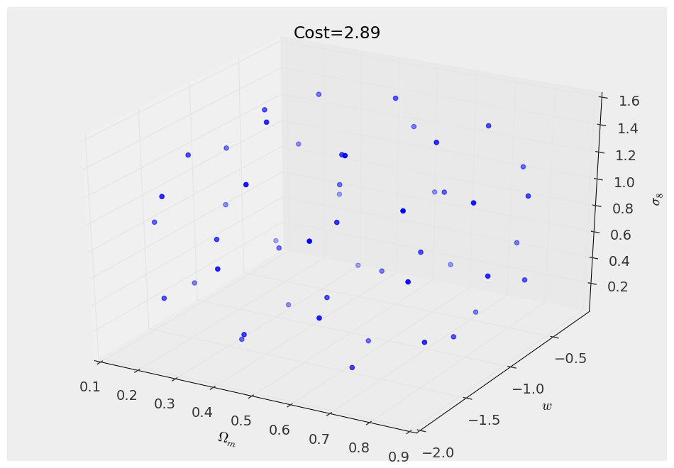
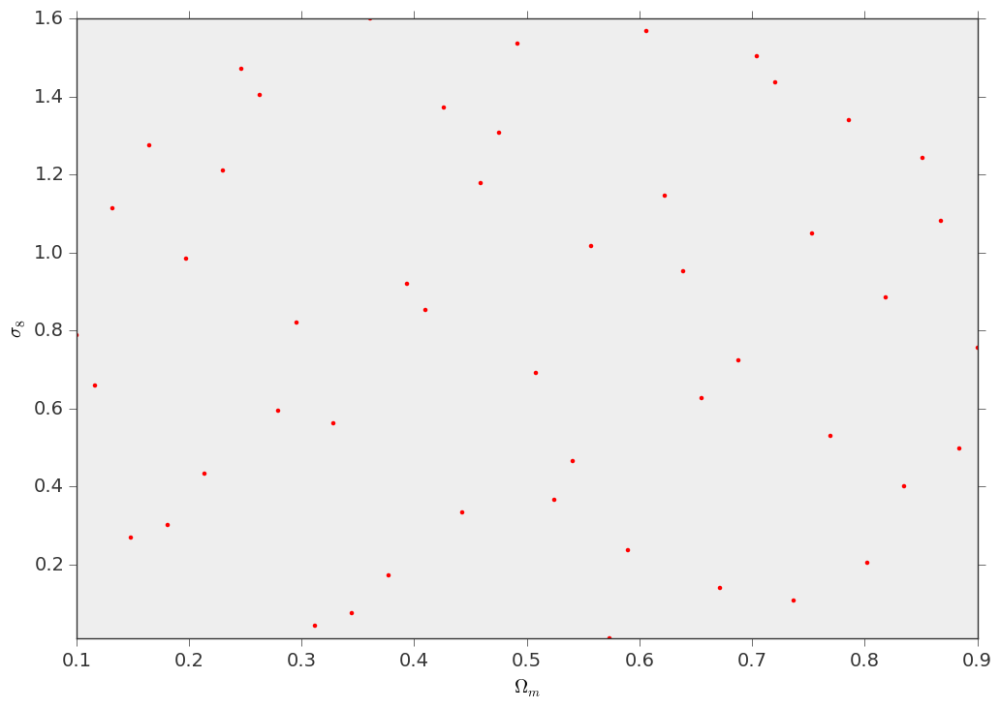
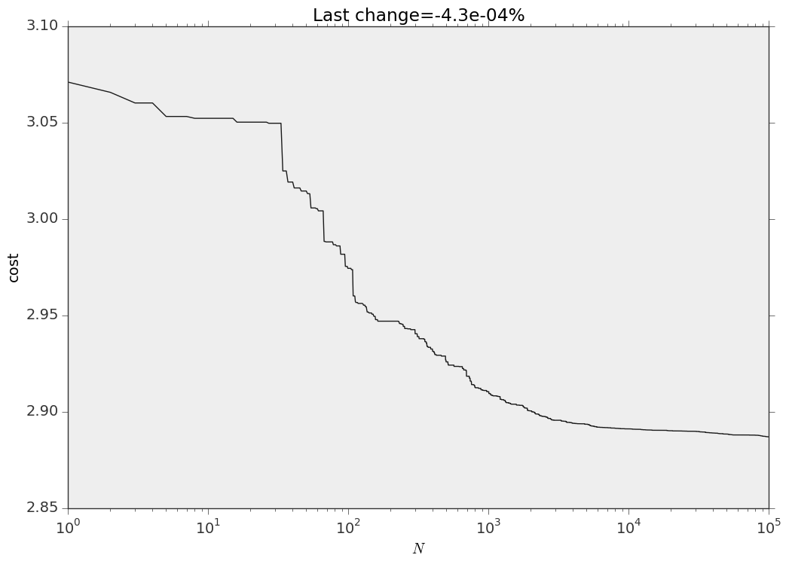

Design your own simulation set
==============================

The target of this example is to get an even sampling of the cosmological parameter space in which points are as spread as possible, within some range; our first application is getting an even sampling of the :math:`(\Omega_m,w,\sigma_8)` parameter space. To do this we use a similar procedure as the Coyote2 people and reduce ourselves to the following problem: we want to draw :math:`N` sample points :math:`\mathbf{x}` in a :math:`D` dimensional hypercube of unit side :math:`(\mathbf{x}\in[0,1]^D)` so that the points are as spread as possible. We also want to enforce the *latin* hypercube structure: when projecting the sample on each dimension, the projected points must not overlap. To solve this problem we adopt an optimization approach, in which we define a measure of how "spread" the points are; given a set of :math:`N` points (or a *design* to use the same terminology as Coyote2) :math:`\mathcal{D}`, one can define a *cost* function :math:`d_{(p,\lambda)}(\mathcal{D})`

.. math:: d_{(p,\lambda)}(\mathcal{D}) = \left(\frac{2}{N(N-1)}\sum_{i<j}\left[\frac{D^{1/p}}{\rho_p(\mathbf{x}_i,\mathbf{x}_j)}\right]^\lambda\right)^{1/\lambda} 

and :math:`\rho_p` is just the :math:`p`-distance between two points

.. math:: \rho_p(\mathbf{x}_i,\mathbf{x}_j)=\left[\sum_{d=1}^D\left\vert x_i^d-x_j^d\right\vert^p\right]^{1/p} 

What we want is find a design :math:`\mathcal{D}` that minimizes the cost function maintaining the latin hypercube structure. To get an intuition of what's the meaning of this, for :math:`(D,p,\lambda)=(3,2,1)` this problem is equivalent to the one of minimizing the potential energy of :math:`N` unit point charges confined in a cube: the repulsive Coulomb force will make sure that these charges are as spread apart as possible.

The algorithm
-------------

We use a rough approximation of the simulated annealing algorithm to perform this task: remember that we want to find a latin hypercube design that minimizes the cost function; the simplest latin hypercube one can think about is a completely diagonal one, call it :math:`\mathcal{D}_0`, defined by the points :math:`x_i^d\equiv i/(N-1)`, :math:`i=0...N-1`, for which one can compute the cost function (which will not depend on :math:`p`, try to believe)

.. math:: d_0(N,\lambda) = \left(\frac{2(N-1)^{\lambda-1}}{N}\sum_{i<j}\frac{1}{\vert i-j\vert^\lambda}\right)^{1/\lambda}

This design of course is far from optimal, but we can improve it by shuffling the particles coordinates for each dimension independently, this will greatly improve the cost of the design. What we can do next is exchange the single coordinates of particle pairs and see if this leads to a cost improvement or not: we can iterate this procedure many times to fine tune to the optimum. In detail the algorithm that we use consists in the following steps:

#. Start from the diagonal design :math:`\mathcal{D}_0 : x_i^d \equiv i/(N-1)`
#. Shuffle the coordinates of the particles in each dimension independently :math:`x_i^d = \mathcal{P}_d\left(\frac{1}{N-1},\frac{2}{N-1},...,1\right)` where :math:`\mathcal{P}_1,...,\mathcal{P}_D` are random independent permutations of :math:`(1,2,...,N)`
#. Pick a random particle pair :math:`(i,j)` and a random coordinate :math:`d\in\{1,...,D\}` and swap :math:`x_i^d\leftrightarrow x_j^d`
#. Compute the new cost function, if this is less than the previous step, keep the exchange, otherwise revert the coordinate swap
#. Repeat steps 3 and 4 
 
We found that :math:`10^5` iterations are enough to achieve convergence (to at least a local optimum) for :math:`N=100` points in :math:`D=3` dimensions with the "Coulomb" cost function with :math:`p=2` and :math:`\lambda=1`.

Examples
--------

Here it is a simple example on how can you build your own simulation design using lenstools

::
	
	from __future__ import print_function

	import sys

	from lenstools.simulations import Design

	import numpy as np
	import matplotlib.pyplot as plt

	#This fails if GSL is not installed
	try:
		design = Design.from_specs(npoints=50,parameters=[("Om",r"$\Omega_m$",0.1,0.9),("w",r"$w$",-2.0,-1.0),("si8",r"$\sigma_8$",0.01,1.6)])
	except ImportError:
		sys.exit(1)

	print(design)

	#The cost function should be the diagonal one
	np.testing.assert_approx_equal(design.diagonalCost(Lambda=1.0),design.cost(p=2.0,Lambda=1.0))

	#Visualize the 3d diagonal configuration
	design.visualize(color="blue")
	design.set_title("Cost={0:.2f}".format(design.diagonalCost(Lambda=1.0)))
	design.savefig("design_diagonal_3d.png")

	#Visualize the 2d (Om,si8) projection
	fig,ax = plt.subplots()
	design.visualize(fig=fig,ax=ax,parameters=["Om","si8"],color="red",marker=".")
	design.savefig("design_diagonal_2d.png")

	#Now perform the sampling of the parameter space, by minimizing the cost function
	deltaPerc = design.sample(Lambda=1.0,p=2.0,seed=1,maxIterations=100000)

	#Visualize the 3d configuration
	design.visualize(color="blue")
	design.set_title("Cost={0:.2f}".format(design.cost(Lambda=1.0,p=2.0)))
	design.savefig("design_3d.png")

	#Visualize the 2d (Om,si8) projection
	fig,ax = plt.subplots()
	design.visualize(fig=fig,ax=ax,parameters=["Om","si8"],color="red",marker=".")
	design.savefig("design_2d.png")

	#Visualize the changes in the cost function
	fig,ax = plt.subplots()
	ax.plot(design.cost_values)
	ax.set_xlabel(r"$N$")
	ax.set_ylabel("cost")
	ax.set_title("Last change={0:.1e}%".format(deltaPerc*100))
	ax.set_xscale("log")
	fig.savefig("cost.png")

This is how your design looks like in 3D space and on the :math:`(\Omega_m,\sigma_8)` projection

And this is the evolution of the cost function 

