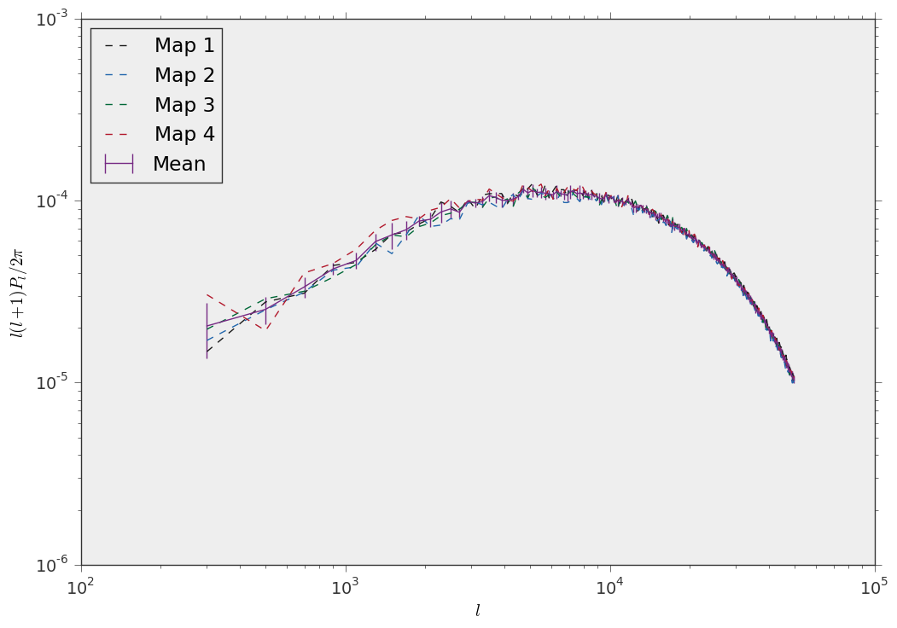

.. _power_spectrum_mpi::

Measure the power spectrum of a convergence map (MPI)
===================================================== 

When you need to measure the power spectrum of many different convergence maps (for example 1000 different realizations of a field of view), you are effectively measuring an Ensemble of quantities. lenstools provides Ensemble computing tools through the :py:class:`~lenstools.statistics.ensemble.Ensemble` class. This class supports parallel operations too through MPI, like in this example. First define a function that measures the power spectrum out of a single map:

::
	
	#The operations on convergence maps are handled with the ConvergenceMap class
	from lenstools import ConvergenceMap

	def measure_power_spectrum(filename,l_edges):

		conv_map = ConvergenceMap.load(filename)
		l,Pl = conv_map.powerSpectrum(l_edges)
		return Pl

This is the actual code: 

::

	from lenstools.statistics.ensemble import Ensemble
	from lenstools.utils.decorators import Parallelize

	import logging

	import numpy as np
	import matplotlib.pyplot as plt

	logging.basicConfig(level=logging.DEBUG)

	@Parallelize.masterworker
	def main(pool): 

		l_edges = np.arange(200.0,50000.0,200.0)
		l = 0.5*(l_edges[:-1] + l_edges[1:])

		conv_ensemble = Ensemble.compute(["Data/conv1.fit","Data/conv2.fit","Data/conv3.fit","Data/conv4.fit"],callback_loader=measure_power_spectrum,pool=pool,l_edges=l_edges)

		fig,ax = plt.subplots()
		for n in range(len(conv_ensemble)):
			ax.plot(l,l*(l+1)*conv_ensemble.iloc[n]/(2.0*np.pi),label="Map {0}".format(n+1),linestyle="--")

		mean = conv_ensemble.mean(0)
		errors = np.sqrt(conv_ensemble.covariance().values.diagonal())

		ax.errorbar(l,l*(l+1)*mean/(2.0*np.pi),yerr=l*(l+1)*errors/(2.0*np.pi),label="Mean")

		ax.set_xscale("log")
		ax.set_yscale("log")
		ax.set_xlabel(r"$l$")
		ax.set_ylabel(r"$l(l+1)P_l/2\pi$")
		ax.legend(loc="upper left")

		plt.savefig("power_ensemble.png")

	if __name__=="__main__":
		main(None)

And this is the result 

